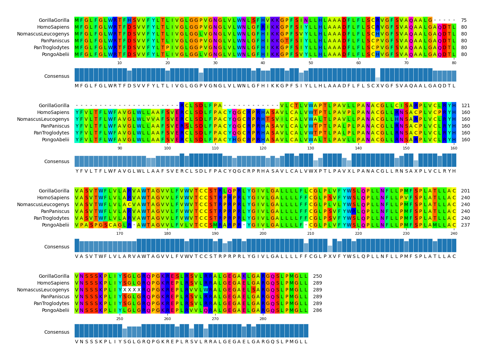

# pymsaviz CLI Document

## Usage

### Basic Command

    pymsaviz -i [MSA file] -o [MSA visualization file]

### Options

    -i I, --infile I    Input MSA file
    -o O, --outfile O   Output MSA visualization file (*.png|*.jpg|*.svg|*.pdf)
    --format            MSA file format (Default: 'fasta')
    --color_scheme      Color scheme (Default: 'Zappo')
    --start             Start position of MSA visualization (Default: 1)
    --end               End position of MSA visualization (Default: 'MSA Length')
    --wrap_length       Wrap length (Default: None)
    --wrap_space_size   Space size between wrap MSA plot area (Default: 3.0)
    --show_grid         Show grid (Default: OFF)
    --show_count        Show seq char count without gap on right side (Default: OFF)
    --show_consensus    Show consensus sequence (Default: OFF)
    --consensus_color   Consensus identity bar color (Default: '#1f77b4')
    --consensus_size    Consensus identity bar height size (Default: 2.0)
    --sort              Sort MSA order by NJ tree constructed from MSA distance matrix (Default: OFF)
    --dpi               Figure DPI (Default: 300)
    -v, --version       Print version information
    -h, --help          Show this help message and exit

    Available Color Schemes:
    ['Clustal', 'Zappo', 'Taylor', 'Flower', 'Blossom', 'Sunset', 'Ocean', 'Hydrophobicity', 'HelixPropensity', 
     'StrandPropensity', 'TurnPropensity', 'BuriedIndex', 'Nucleotide', 'Purine/Pyrimidine', 'Identity', 'None']

### Example Command

Click [here](https://github.com/moshi4/pyMSAviz/raw/main/example/example.zip) to download example MSA files.  

#### Example 1

    pymsaviz -i ./example/HIGD2A.fa -o cli_example01.png --color_scheme Identity

  

#### Example 2

    pymsaviz -i ./example/MRGPRG.fa -o cli_example02.png --wrap_length 80 \
             --color_scheme Taylor --show_consensus --show_count

  

#### Example 3

    pymsaviz -i ./example/MRGPRG.fa -o cli_example03.png --start 100 --end 160 \
             --color_scheme Flower --show_grid --show_consensus --consensus_color tomato 

  
