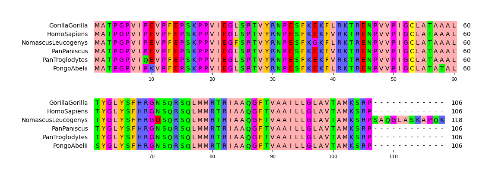
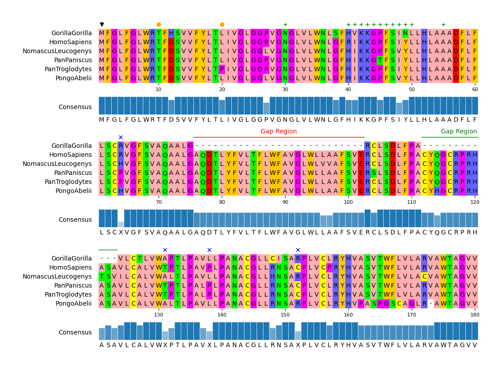

# pyMSAviz

  

## Overview

pyMSAviz is a MSA(Multiple Sequence Alignment) visualization python package for sequence analysis implemented based on matplotlib.
This package is developed for the purpose of easily and beautifully plotting MSA in Python.
pyMSAviz is inspired by [Jalview](https://www.jalview.org/) and [ggmsa](https://github.com/YuLab-SMU/ggmsa) (R package).

<figure markdown>
  
  <figcaption>pyMSAviz example figure 01</figcaption>
</figure>

<figure markdown>
  
  <figcaption>pyMSAviz example figure 02</figcaption>
</figure>

## Installation

`Python 3.7 or later` is required for installation.

**Install PyPI package:**

    pip install pymsaviz

**Install bioconda package:**

    conda install -c conda-forge -c bioconda pymsaviz
